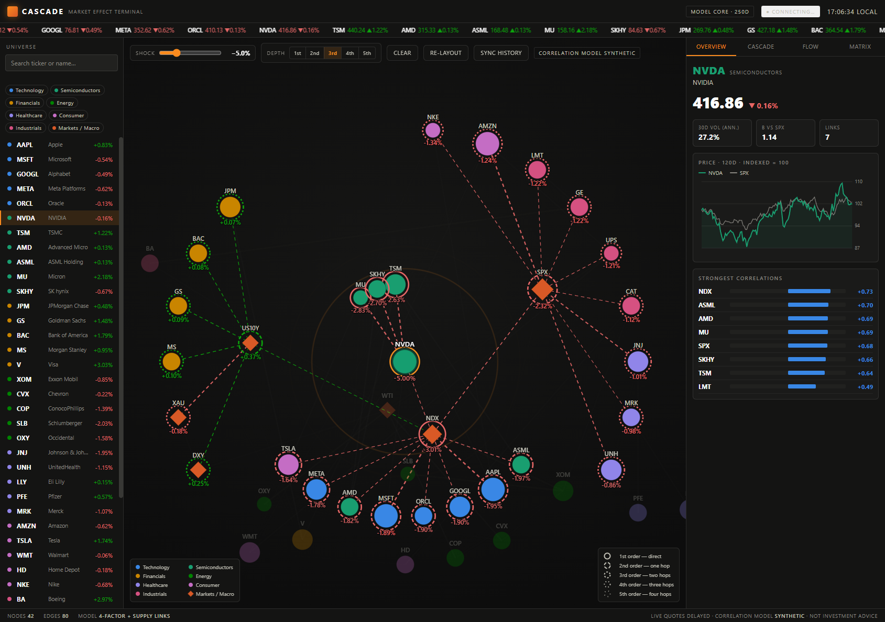

# CASCADE — Market Effect Terminal

A Bloomberg-style desktop terminal that visualizes **1st- through 5th-order
market effects** and cross-asset **correlations** as a force-directed network,
with a live shock-propagation model and a live **options-flow** board.

Runs entirely on your machine, in any browser.



## Run it

```bash
python server.py            # starts the proxy + serves the UI on :8474
# then open  http://localhost:8474
```

Python 3.9+; **no pip install** — pure standard library. `--port N` to change port.

The page also works opened as a bare file, but then it runs in **model-only**
mode (no live data) because the browser can't reach the feeds directly. Run
`server.py` to get live quotes and options.

## What's live vs. modelled

| Layer | Source | Notes |
|---|---|---|
| Quotes (price / day change) | Yahoo Finance `spark` | ~15-min delayed; refreshes every 30 s |
| Selected-name sparkline | Yahoo Finance `chart` (6 mo daily) | real history, indexed vs SPX |
| Options flow (most active) | **CBOE** delayed option chains | volume / OI / IV, ~15-min delayed |
| Correlation network + shock cascade | **synthetic** 4-factor model (seeded) by default; **live** Pearson correlations (6 mo daily history) one click away via **Sync History** | `/api/correlation`, cached 15 min |

The header pill shows the live status; click it to pause/resume the feed. If
`server.py` isn't running the UI degrades gracefully to the synthetic model.
**Sync History** replaces the seeded network with correlations computed from
real historical returns for the current universe — it's opt-in (not the
default) so the app still loads instantly and works offline.

## The three views

- **Network** — instruments as nodes (size = weight, color = sector, diamonds =
  macro refs like WTI / US10Y / DXY / Gold / SPX). Drag, pan, zoom. Click a node
  to **shock** it and watch effects ripple outward by order (solid → sparse-dashed
  halos). The **Shock** slider sets magnitude; **Depth** picks 1st–5th order.
- **Right panel** — *Overview* (live price, β, top correlations, live sparkline);
  *Cascade* (net impact, breadth, **conviction** from reinforcing paths, plain-
  English read, per-order transmission tables); *Flow* (today's most active
  options — market put/call, busiest underlyings, top contracts); *Matrix*
  (sector-grouped correlation heatmap).

Deep-linkable: `?sel=WTI&tab=cascade&shock=6&depth=4`.

## Honest limitations

- **Delayed, not real-time.** Free feeds are ~15 min behind. Fine for home study,
  not for execution.
- **"Most active", not "most purchased."** Volume counts contracts traded; it does
  **not** classify buyers vs sellers. True buy/sell "unusual options" flow needs a
  paid trade-side feed (e.g. Unusual Whales). Don't read call volume as "bullish."
- **Correlations are synthetic by default.** The network loads as a coherent
  seeded factor model; click **Sync History** to rebuild it from real 6-month
  daily returns instead.
- **Not investment advice.** This is an analysis/visualization tool.

## Roadmap

- Multi-shock / scenario compare (shock two names, diff the cascades).
- Optional paid options-flow provider for real buy/sell classification (cost
  decision, not yet planned).

## Files

- `index.html` — the entire UI (self-contained: SVG network, canvas matrix, charts).
- `server.py` — stdlib proxy: `/api/quotes`, `/api/history`, `/api/options/active`.
